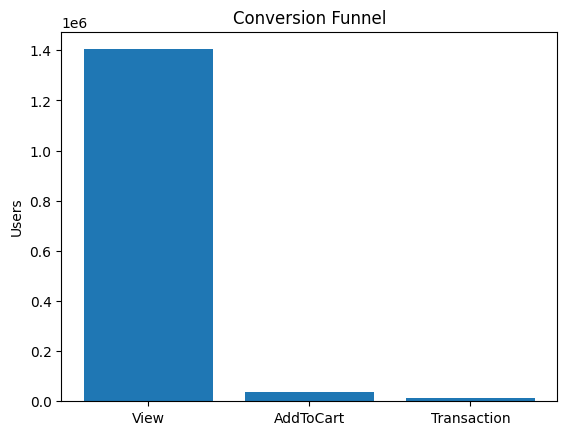
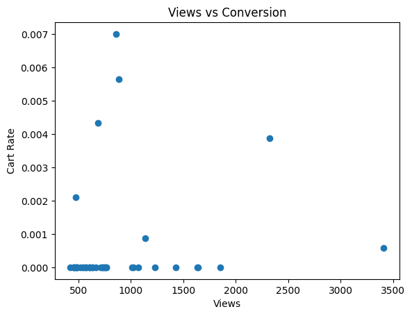
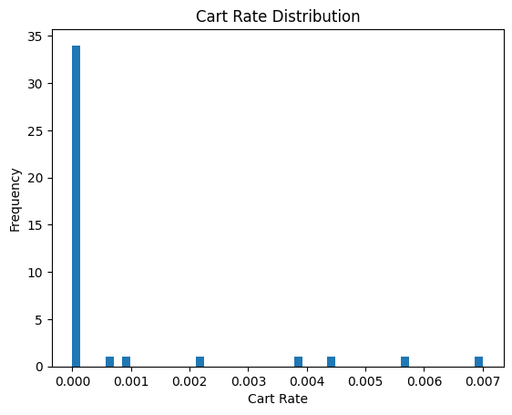
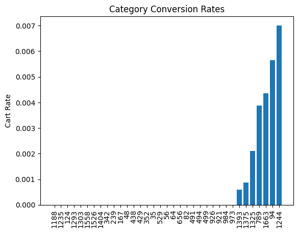
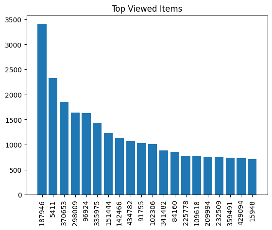

# RetailRocket Funnel Analysis

## Headline

"6,189 products across 21 categories are generating views with near-zero cart additions — traffic isn't the issue, the product page is."

---

## Business Context

RetailRocket is a retention management platform that provides conversion strategies for e-commerce businesses. The dataset covers 1,404,179 unique users, of whom only 2.68% add a product to cart. A 1% improvement in that rate would bring 13,951 additional users into the purchase funnel.

---

## Approach

The investigation started by counting unique users at each funnel stage to locate where the drop occurs. View-to-addtocart came out as the weakest step. To find the cause, items with high views and near-zero addtocart were isolated — 6,189 items crossed the 95th percentile view threshold while staying below the 2.68% conversion baseline. A sample of 50 items was pulled for deeper inspection. Nine of those had no metadata at all. The remaining 41 spanned 21 different categories with no clustering, which ruled out a category-level explanation and pointed to a product-level problem.

---

## Findings

**Finding 1:** 1,404,179 unique viewers, 37,722 unique addtocart users, and 11,791 unique transactions across the dataset.

**Finding 2:** View-to-addtocart conversion sits at 2.68%. Addtocart-to-transaction conversion is 31.25% — the checkout stage is not the problem.

**Finding 3:** 6,189 items sit above the 95th percentile view threshold with near-zero addtocart rates. These items are the primary source of conversion loss.

**Finding 4:** 9 items from the top 50 shortlist have no metadata in the item properties dataset — no category, no attributes — yet continue to generate views.

---

## Recommendations

**Recommendation 1** — Fix metadata gaps first (based on Finding 4)

9 items in the top-50 highest-view list have no metadata — no category, no attributes, no product information. These items average 466 views each but convert at zero. Conduct a metadata audit across the full 6,189 item shortlist, prioritizing these 9 items first. Fixing them alone could recover an estimated 112 additional cart additions at the current 2.68% baseline.

**Recommendation 2** — Audit high-view, zero-action product pages (based on Finding 3)

6,189 items sit above the 95th percentile for views but remain below the 2.68% conversion baseline. The problem is not traffic — these items are being seen and rejected. Conduct a product page audit starting with items that have zero cart additions despite 1,000+ views, investigating page clarity, pricing visibility, image quality, and trust signals.

---

## Visualizations

**Conversion Funnel**



**Views vs Conversion Rate**



**Cart Rate Distribution**



**Category Conversion Rates**



**Top Viewed Items**


---

## Technical Proof

**Dataset:** [RetailRocket E-Commerce Dataset](https://www.kaggle.com/datasets/retailrocket/ecommerce-dataset)

---

**Business question:** How many unique users exist at each funnel stage?

```sql
SELECT COUNT(DISTINCT visitorid) AS Number_of_users,
  COUNT(DISTINCT CASE WHEN event = 'view' THEN visitorid END) AS Number_of_Unique_View,
  COUNT(DISTINCT CASE WHEN event = 'addtocart' THEN visitorid END) AS Number_of_Unique_AddtoCart,
  COUNT(DISTINCT CASE WHEN event = 'transaction' THEN visitorid END) AS Number_of_Unique_Transaction
FROM events;
```

---

**Business question:** What is the 95th percentile view threshold for identifying high-view products?

```sql
WITH view_per_item AS (
  SELECT itemid, COUNT(DISTINCT visitorid) AS count_view
  FROM events
  WHERE event = 'view'
  GROUP BY itemid
),
ranked AS (
  SELECT itemid, count_view,
    ROW_NUMBER() OVER (ORDER BY count_view) AS rn,
    COUNT(*) OVER () AS total
  FROM view_per_item
)
SELECT count_view
FROM ranked
WHERE rn = FLOOR(total * 0.95);
```

---

**Business question:** Which items have high views but near-zero addtocart, ranked by missed opportunity?

```sql
WITH view_per_item AS (
  SELECT itemid, COUNT(DISTINCT visitorid) AS count_view
  FROM events
  WHERE event = 'view'
  GROUP BY itemid
),
addtocart_per_item AS (
  SELECT itemid, COUNT(DISTINCT visitorid) AS count_addtocart
  FROM events
  WHERE event = 'addtocart'
  GROUP BY itemid
)
SELECT
  v.itemid,
  (v.count_view * 0.0268) - IFNULL(a.count_addtocart, 0) AS miss_addtocart
FROM view_per_item v
LEFT JOIN addtocart_per_item a ON v.itemid = a.itemid
WHERE (IFNULL(a.count_addtocart, 0) / v.count_view) * 100 < 2.6
  AND v.count_view > 36
ORDER BY miss_addtocart DESC, v.count_view DESC;
```

---

**Business question:** Which items in the top 50 shortlist are missing metadata entirely?

```python
result_ids = set(df_latest['itemid'])
input_ids = set(top_50_ids)
missing_ids = input_ids - result_ids
print(len(missing_ids), sorted(missing_ids))

# 9 items confirmed missing:
top_9_ids = [29100, 156173, 184998, 229204, 244924, 260650, 287664, 298196, 449571]
```

## Kaggle Notebook

- Kaggle Notebook: [RetailRocket Funnel Analysis Notebook](https://www.kaggle.com/code/roshanvishwakarma15/retailrocket-funnel-analysis)

---
